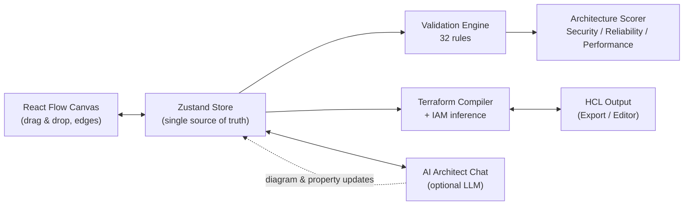

# InGen — Infrastructure Generator

> Design AWS infrastructure visually, validate it instantly against 32 real-world rules, and export production-ready Terraform — powered by an optional AI architect.

**Live app → [in-gen-five.vercel.app](https://in-gen-five.vercel.app/)**
**Landing page → [in-gen-five.vercel.app/landing](https://in-gen-five.vercel.app/landing)**

---

## Demo

> 🎥 Demo GIF coming soon — a walkthrough of generating an architecture from a prompt, watching validation fire in real time, and exporting Terraform.

---

## Quick Start

The fastest way to try InGen is the hosted version — no install, no account:

👉 **[in-gen-five.vercel.app](https://in-gen-five.vercel.app/)**

### Run it locally

```bash
git clone https://github.com/TahrimWalid/in-gen.git
cd in-gen/frontend
npm install
npm run dev
```

Open [http://localhost:3000](http://localhost:3000).

The AI Architect chat and AI-assisted generation are optional — see [Configuration](#configuration) to bring your own model.

---

## What InGen Is

InGen is **not a diagramming tool** — it's an infrastructure compiler with a visual interface. Drag AWS components onto a canvas (or describe your architecture in plain English), and InGen:

1. Validates the architecture locally against **32 deterministic rules** — no API calls, zero latency
2. Scores your design across **Security, Reliability, and Performance**
3. Compiles the diagram into **production-ready Terraform HCL**, with IAM roles and policies auto-inferred from how components are connected

What you draw is what gets deployed — no drift between the diagram and the code.

---

## Features

| | |
|---|---|
| **AI Architecture Generation** | Describe your app in plain English. InGen generates a complete AWS serverless architecture using Terraform. |
| **32 Validation Rules** | Real-time checks for security, reliability, and performance — SQS timeout mismatches, exposed S3 buckets, missing WAF, EOL Lambda runtimes, and more. |
| **Architecture Scoring** | Security, Reliability, and Performance scores update live as you design, so you know your architecture quality before you deploy. |
| **Bidirectional HCL Editor** | Edit Terraform directly and watch the diagram update. Edit the diagram and watch the HCL update. Always in sync. |
| **Import Existing Terraform** | Paste or upload your existing `.tf` files to visualise and validate your current infrastructure instantly. |
| **AI Architect Chat** | Ask your architecture anything — "Does this scale?", "Is this HIPAA-compliant?", "What's missing?" |
| **Issue Detail Drawer** | Every validation issue expands into "Why This Matters", "What Happens If Ignored", a one-click fix, and a link to the relevant AWS docs. |
| **Workspaces** | Up to 3 named workspaces, each with its own canvas and chat history, persisted locally. |
| **Light / Dark Theme** | Full theme coverage across the canvas, panels, and editor. |

---

## How It Works



1. **Draw** — drag AWS components (Lambda, API Gateway, DynamoDB, S3, SQS, SNS, EventBridge, Cognito) onto the canvas and connect them with semantic edges
2. **Validate** — the rules engine runs locally on every change, flagging anti-patterns with badges instantly
3. **Export** — click "Export Terraform" for deployable HCL with IAM roles and policies auto-inferred from your connections, or edit HCL directly in the bidirectional editor

---

## Tech Stack

- **Next.js 16** (App Router) + **React 19**
- **ReactFlow 11** — canvas and graph engine
- **Zustand 5** — state management, manual persistence to `localStorage`
- **Tailwind CSS v4** — PostCSS plugin
- **Monaco Editor** — bidirectional HCL editor with autocomplete, formatting, and live error markers
- **@cdktf/hcl2json** — server-side Terraform HCL → JSON parsing (WASM)
- **Deployment** — Vercel

---

## Configuration

AI features (architecture generation, chat, auto-remediation via chat) are powered by any **OpenAI-compatible** chat completions endpoint. Copy `frontend/.env.local.example` to `frontend/.env.local`:

```bash
LLM_BASE_URL=   # e.g. https://api.anthropic.com, http://localhost:11434, or your own vLLM/Ollama server
LLM_API_KEY=    # leave empty for unauthenticated local endpoints
LLM_MODEL=      # e.g. claude-sonnet-4-6, qwen3:6b, gpt-4o
```

Bring your **own API key**, or point `LLM_BASE_URL` at a **self-hosted model** for full data privacy. The deterministic validation engine and Terraform compiler work fully offline regardless — AI is an optional layer on top.

---

## Roadmap

### Now
- Beta polish, landing page, demo materials

### Phase 4 — Persistence & Auth
- Supabase database integration
- User authentication
- Save/load diagrams from the database

### Observability & Security
- Expanded rule set covering more AWS services and deeper security/compliance checks
- Compliance presets (SOC2, HIPAA)
- Security posture overlays on the canvas

### CloudCraft-style Capabilities
- **FinOps / cost estimation** — live cost projections as you design
- **Live infrastructure mapping** — import real AWS account state and visualise what's actually deployed
- Drift detection between deployed infrastructure and the diagram

### V2+
- Multi-cloud support (Azure, GCP)
- Self-hosted Docker deployment for enterprise / regulated environments
- IaC round-tripping and CDK export

---

## Contributing

Contributions are welcome! If you spot a bug, have a feature idea, or want to add a new validation rule:

1. Open an issue describing the bug or proposal
2. Fork the repo and create a feature branch (`git checkout -b feature/your-feature`)
3. Open a pull request against `main`

For AI-related contributions, you can develop against your own API key or a self-hosted model — see [Configuration](#configuration).

## License

MIT
